# 🐾 Patitas - ABP Módulo 7

## Desarrollo de Aplicaciones Full Stack JavaScript

Este proyecto corresponde al **ABP del Módulo 7** del curso Desarrollo de Aplicaciones Full Stack JavaScript.

El proyecto continúa el trabajo realizado anteriormente con **Patitas**, una aplicación orientada a la gestión de mascotas y procesos de adopción.

En el Módulo 6 trabajé principalmente con Node.js, Express y persistencia mediante archivos JSON. Para esta nueva etapa el objetivo fue avanzar hacia una persistencia real utilizando **PostgreSQL**, incorporando consultas SQL, Sequelize ORM, relaciones entre modelos y transacciones.

Durante el desarrollo decidí utilizar tanto `pg` como Sequelize para poder practicar y comparar las dos formas de trabajar con una base de datos vistas durante el módulo.

---

# 📌 Objetivo del proyecto

El objetivo principal de esta etapa fue conectar el servidor Express con PostgreSQL y desarrollar operaciones que permitieran:

- Crear información.
- Consultar información.
- Actualizar registros.
- Eliminar registros.
- Relacionar distintas tablas.
- Utilizar SQL parametrizado.
- Utilizar Sequelize ORM.
- Implementar transacciones.
- Utilizar `COMMIT`.
- Utilizar `ROLLBACK`.
- Consultar información relacionada mediante `include`.
- Mantener la persistencia real de los datos.

La aplicación permite trabajar con:

- Perfiles.
- Usuarios.
- Mascotas.
- Fichas de mascotas.
- Solicitudes de adopción.

---

# 🛠️ Tecnologías utilizadas

Para desarrollar este proyecto utilicé:

- JavaScript.
- Node.js.
- Express.js.
- PostgreSQL.
- pg.
- Sequelize.
- pg-hstore.
- dotenv.
- Postman.
- pgAdmin.
- Visual Studio Code.

---

# 📦 Dependencias

Las principales dependencias utilizadas en el proyecto son:

```json
{
  "dotenv": "^17.4.2",
  "express": "^5.2.1",
  "pg": "^8.23.0",
  "pg-hstore": "^2.3.4",
  "sequelize": "^6.37.8"
}
```

---

# 📁 Estructura del proyecto

La estructura fue organizada separando las distintas responsabilidades del backend.

```text
ABP_M7/
│
├── server.js
├── package.json
├── package-lock.json
├── .gitignore
├── .env
├── README.md
│
└── src/
    │
    ├── config/
    │   ├── dbPg.js
    │   └── dbSequelize.js
    │
    ├── controllers/
    │   ├── usuario.controller.js
    │   ├── perfil.controller.js
    │   ├── mascota.controller.js
    │   └── solicitudAdopcion.controller.js
    │
    ├── middlewares/
    │   └── validarBody.js
    │
    ├── models/
    │   ├── Usuario.models.js
    │   ├── Perfil.models.js
    │   ├── Mascota.models.js
    │   ├── FichaMascota.models.js
    │   ├── SolicitudAdopcion.models.js
    │   └── index.js
    │
    ├── routes/
    │   ├── usuario.routes.js
    │   ├── perfil.routes.js
    │   ├── mascota.routes.js
    │   └── solicitudAdopcion.routes.js
    │
    ├── img/
    │   ├── 01_get_usuarios.png
    │   ├── 02_get_perfiles.png
    │   ├── 03_get_mascotas.png
    │   ├── 04_get_solicitudes.png
    │   ├── 05_post_mascota_ficha.png
    │   ├── 06_put_solicitud.png
    │   ├── 07_delete_registro.png
    │   ├── 08_rollback_error.png
    │   ├── 09_rollback_bd.png
    │   ├── 10_base_datos.png
    │   └── 11_relaciones_bd.png
    │
    └── app.js
```

Esta separación permite mantener independientes las rutas, controladores, modelos, configuraciones y middlewares.

---

# ⚙️ Instalación

## 1. Clonar el repositorio

```bash
git clone https://github.com/jorgedu-start/ABP_M7_Patitas
```

## 2. Entrar a la carpeta del proyecto

```bash
cd ABP_M7_Patitas
```

## 3. Instalar las dependencias

```bash
npm install
```

## 4. Crear archivo `.env`

En la raíz del proyecto se debe crear un archivo:

```text
.env
```

Ejemplo de configuración:

```env
DB_HOST=localhost
DB_PORT=5432
DB_NAME=abp_m7_patitas
DB_USER=postgres
DB_PASSWORD=tu_password
PORT=3000
```

El archivo `.env` no se encuentra incluido en el repositorio porque contiene información sensible.

---

# 🔐 Protección de información sensible

Para evitar almacenar las credenciales directamente dentro del código utilicé variables de entorno mediante `dotenv`.

Los datos de conexión se obtienen mediante:

```js
process.env
```

Además, el archivo `.gitignore` contiene:

```gitignore
node_modules/
.env
```

De esta forma:

- Las credenciales no se suben a GitHub.
- La carpeta `node_modules` tampoco se almacena en el repositorio.
- Las dependencias pueden instalarse nuevamente mediante `npm install`.

---

# ▶️ Ejecución del proyecto

El proyecto puede ejecutarse mediante:

```bash
npm run dev
```

o:

```bash
npm start
```

Durante el desarrollo utilicé:

```bash
npm run dev
```

para aprovechar el modo `watch` de Node.

---

# 🗄️ Base de datos

Para esta etapa del proyecto utilicé **PostgreSQL**.

Trabajé con dos formas distintas de acceso a la misma base de datos:

### pg

Utilizado para ejecutar consultas SQL directamente desde Node.js.

### Sequelize

Utilizado como ORM para trabajar con modelos, asociaciones, consultas relacionadas y transacciones.

Ambas conexiones trabajan sobre la misma base de datos:

```text
abp_m7_patitas
```

---

# 🔌 Conexión mediante pg

Para trabajar con SQL directo utilicé el paquete:

```text
pg
```

La conexión utiliza un `Pool`, permitiendo realizar consultas directamente desde los controladores.

Esta forma de conexión fue utilizada principalmente para desarrollar el CRUD de **Perfiles**.

---

# 🔌 Conexión mediante Sequelize

Para trabajar mediante ORM utilicé:

```text
Sequelize
```

Sequelize permitió definir modelos de JavaScript que representan las tablas de PostgreSQL.

También fue utilizado para:

- CRUD.
- Relaciones.
- Claves foráneas.
- `include`.
- Transacciones.
- Validaciones.
- Persistencia.

La sincronización quedó finalmente configurada como:

```js
await sequelize.sync();
```

Durante el desarrollo utilicé temporalmente otras opciones para reconstruir las tablas, pero antes de la entrega dejé la sincronización normal para evitar eliminar información al reiniciar el servidor.

---

# 🧩 Modelos

## Perfil

El modelo Perfil representa los distintos roles que pueden existir dentro de la aplicación.

Campos principales:

```text
id
nombre
descripcion
created_at
updated_at
```

Se cargaron como datos de prueba perfiles como:

- Administrador.
- Adoptante.
- Colaborador.

---

# 👤 Usuario

El modelo Usuario representa a las personas registradas en el sistema.

Campos:

```text
id
nombre
email
password
perfil_id
created_at
updated_at
```

Se configuraron validaciones para:

- Nombre obligatorio.
- Email obligatorio.
- Email válido.
- Email único.
- Password obligatorio.
- Password con una cantidad mínima de caracteres.

La contraseña no se devuelve en las consultas GET.

---

# 🐕 Mascota

El modelo Mascota representa las mascotas registradas en el sistema.

Campos:

```text
id
nombre
especie
edad
sexo
estado
usuario_id
created_at
updated_at
```

El campo `usuario_id` permite identificar al usuario relacionado con la mascota.

---

# 🩺 FichaMascota

Este modelo contiene información relacionada con la salud de cada mascota.

Campos:

```text
id
vacunado
esterilizado
descripcion_salud
mascota_id
created_at
updated_at
```

Cada mascota posee una ficha relacionada.

---

# 📝 SolicitudAdopcion

Este modelo permite registrar las solicitudes realizadas por los usuarios para adoptar mascotas.

Campos:

```text
id
fecha_solicitud
estado
comentario
usuario_id
mascota_id
created_at
updated_at
```

El estado inicial de una solicitud es:

```text
Pendiente
```

Posteriormente puede actualizarse, por ejemplo, a:

```text
Aprobada
Rechazada
```

---

# 🔗 Relaciones implementadas

Durante el proyecto trabajé diferentes tipos de relaciones para practicar las asociaciones disponibles mediante Sequelize.

---

## Perfil 1:N Usuario

```text
Perfil 1 ───────── N Usuario
```

Un perfil puede pertenecer a varios usuarios.

La clave foránea se encuentra en:

```text
Usuarios.perfil_id
```

La relación utiliza:

```text
onDelete: SET NULL
onUpdate: CASCADE
```

Esto permite que si un perfil es eliminado, el usuario pueda continuar existiendo y su FK quede en `NULL`.

---

## Usuario 1:N Mascota

```text
Usuario 1 ───────── N Mascota
```

Un usuario puede estar relacionado con varias mascotas.

La clave foránea queda en:

```text
Mascotas.usuario_id
```

---

## Mascota 1:1 FichaMascota

```text
Mascota 1 ───────── 1 FichaMascota
```

Cada mascota tiene una ficha asociada.

La FK queda en:

```text
Fichas_Mascotas.mascota_id
```

También se utiliza una restricción `unique` para evitar que una misma mascota tenga más de una ficha.

---

## Usuario N:M Mascota

Para representar la relación entre usuarios y mascotas utilicé el modelo:

```text
SolicitudAdopcion
```

La relación puede observarse de la siguiente manera:

```text
Usuario
   │
   │ 1:N
   ▼
SolicitudAdopcion
   ▲
   │ N:1
   │
Mascota
```

Visto desde Usuario y Mascota, corresponde a una relación:

```text
Usuario N:M Mascota
```

De esta forma:

- Un usuario puede realizar solicitudes por diferentes mascotas.
- Una mascota puede recibir solicitudes de diferentes usuarios.

---

# 🔎 Consultas relacionadas mediante include

Sequelize permite utilizar `include` para consultar datos relacionados.

Por ejemplo, al consultar una mascota se devuelve:

```text
Mascota
├── Usuario
└── Ficha
```

Esto permite obtener los datos principales de la mascota y también la información relacionada sin realizar diferentes peticiones.

En el caso de las solicitudes:

```text
Solicitud
├── Usuario
└── Mascota
```

Se utilizaron también `attributes` para controlar qué campos se devuelven.

Esto permitió evitar respuestas con demasiada información repetida.

---

# 🏷️ Uso de alias

Durante las pruebas Sequelize generaba algunos nombres poco claros de forma automática.

Para mejorar las respuestas utilicé alias como:

```text
usuario
mascota
ficha
```

De esta forma las respuestas JSON son más fáciles de comprender.

---

# 👤 CRUD Usuarios

El CRUD de Usuarios fue realizado con Sequelize.

Rutas:

```text
POST   /usuarios
GET    /usuarios
GET    /usuarios/:id
PUT    /usuarios/:id
DELETE /usuarios/:id
```

Métodos principales de Sequelize utilizados:

```text
create()
findAll()
findByPk()
update()
destroy()
```

También se permite asociar el usuario con un Perfil mediante:

```text
perfil_id
```

---

# 🧩 CRUD Perfiles

El CRUD de Perfiles fue realizado mediante `pg` y SQL directo.

Rutas:

```text
POST   /perfiles
GET    /perfiles
GET    /perfiles/:id
PUT    /perfiles/:id
DELETE /perfiles/:id
```

Para evitar insertar valores directamente dentro de las consultas utilicé SQL parametrizado.

Ejemplo:

```sql
UPDATE "Perfiles"
SET
    nombre = $1,
    descripcion = $2,
    updated_at = NOW()
WHERE id = $3
RETURNING *;
```

Los valores:

```text
$1
$2
$3
```

son reemplazados por los parámetros enviados desde Node.js.

---

# 🐾 CRUD Mascotas

El CRUD de Mascotas fue realizado utilizando Sequelize.

Rutas:

```text
POST   /mascotas
GET    /mascotas
GET    /mascotas/:id
PUT    /mascotas/:id
DELETE /mascotas/:id
```

La creación de Mascota además crea la ficha relacionada dentro de una misma transacción.

El PUT también permite actualizar:

- Datos de la mascota.
- Datos de su ficha.

---

# 📝 CRUD Solicitudes de adopción

Rutas:

```text
POST   /solicitudes
GET    /solicitudes
GET    /solicitudes/:id
PUT    /solicitudes/:id
DELETE /solicitudes/:id
```

Al crear una solicitud se registran:

```text
usuario_id
mascota_id
comentario
```

La fecha se genera automáticamente y el estado inicial es:

```text
Pendiente
```

Para actualizar una solicitud decidí modificar principalmente:

```text
estado
comentario
```

No se cambia normalmente el usuario ni la mascota, porque estos datos indican quién realizó la solicitud y por qué mascota.

---

# 🔄 Transacciones

Uno de los principales temas trabajados durante este módulo fue el uso de transacciones.

Una transacción permite ejecutar varias operaciones como una sola unidad.

Si todas las operaciones funcionan:

```text
COMMIT
```

Si alguna falla:

```text
ROLLBACK
```

Esto permite evitar que la base de datos quede con información incompleta.

---

# 🔄 Transacciones con pg

En el CRUD de Perfiles se trabajó manualmente con:

```js
const client = await pool.connect();

await client.query("BEGIN");
```

Después de ejecutar correctamente la operación:

```js
await client.query("COMMIT");
```

En caso de error:

```js
await client.query("ROLLBACK");
```

Finalmente se libera la conexión:

```js
client.release();
```

Durante el desarrollo pude comprobar que una operación puede devolver información aparentemente correcta, pero si no se ejecuta `COMMIT`, el cambio no queda persistido realmente en PostgreSQL.

---

# 🔄 Transacciones con Sequelize

Con Sequelize utilicé:

```js
const t = await sequelize.transaction();
```

Las operaciones se ejecutan utilizando:

```js
{ transaction: t }
```

Cuando todo funciona correctamente:

```js
await t.commit();
```

En caso de error:

```js
await t.rollback();
```

---

# 🐾 Transacción real Mascota + FichaMascota

Para demostrar una transacción con dos operaciones realmente dependientes utilicé la creación de una mascota y su ficha.

La lógica utilizada es:

```text
1. Crear Mascota
2. Obtener mascota.id
3. Crear FichaMascota utilizando mascota_id
4. COMMIT
```

La segunda operación depende de la primera, porque la ficha necesita conocer el ID de la mascota.

Si ocurre un error durante la creación de la ficha:

```text
Mascota creada temporalmente
        ↓
FichaMascota falla
        ↓
ROLLBACK
        ↓
Mascota tampoco queda almacenada
```

Esto evita dejar una mascota registrada sin su ficha correspondiente.

---

# ❌ Prueba intencional de ROLLBACK

Para comprobar el funcionamiento de la transacción provoqué intencionalmente un error.

Durante el POST de una mascota envié un dato inválido en un campo obligatorio de la ficha.

Postman devolvió:

```text
500 Internal Server Error
```

Después consulté directamente PostgreSQL:

```sql
SELECT *
FROM "Mascotas"
WHERE nombre = 'PruebaRollback';
```

La consulta devolvió cero registros.

Esto permitió comprobar que `ROLLBACK` eliminó también la primera operación de la transacción.

---

# 🆚 SQL directo y Sequelize

Durante este proyecto utilicé ambas formas de acceso a datos.

## pg + SQL

Trabajar directamente con SQL me permitió comprender mejor:

- SELECT.
- INSERT.
- UPDATE.
- DELETE.
- WHERE.
- Parámetros.
- BEGIN.
- COMMIT.
- ROLLBACK.

También entrega mayor control sobre la consulta que se ejecuta.

Sin embargo, requiere escribir manualmente más lógica.

## Sequelize ORM

Sequelize permite trabajar mediante modelos JavaScript.

Entre las ventajas que pude observar:

- Menor cantidad de SQL escrito manualmente.
- Modelos más fáciles de relacionar.
- Relaciones mediante asociaciones.
- Consultas relacionadas mediante `include`.
- Manejo de transacciones integrado.
- Métodos como `create`, `findAll`, `findByPk` y `destroy`.

Considero que trabajar primero SQL directamente ayudó a comprender mejor lo que Sequelize realiza internamente.

---

# ✅ Validaciones utilizadas

Durante el desarrollo implementé distintas validaciones.

Entre ellas:

- Validación de `req.body`.
- Campos obligatorios.
- Validación de registros existentes.
- Email válido.
- Email único.
- Password mínimo.
- Uso de claves foráneas.
- Manejo de errores con `try/catch`.
- Uso de `WHERE` en UPDATE y DELETE.
- Exclusión de password en consultas.
- Códigos HTTP adecuados.

---

# 🌐 Códigos HTTP utilizados

Durante las pruebas trabajé principalmente con:

```text
200 OK
201 Created
400 Bad Request
404 Not Found
500 Internal Server Error
```

Esto permite informar correctamente el resultado de cada operación.

---

# 🧪 Datos semilla

Antes de realizar las pruebas finales limpié la base de datos y cargué información semilla directamente desde pgAdmin.

La carga se realizó respetando el orden de las relaciones:

```text
1. Perfiles
2. Usuarios
3. Mascotas
4. Fichas_Mascotas
5. Solicitudes_Adopcion
```

Esto permite respetar las claves foráneas.

Se incorporaron diferentes mascotas para realizar las pruebas, incluyendo perros, gatos, aves y otras especies.

---

# 🧪 Pruebas

Las rutas fueron probadas utilizando Postman.

También utilicé pgAdmin para comprobar directamente la persistencia de la información.

Se probaron operaciones:

```text
GET
POST
PUT
DELETE
```

Además se realizaron pruebas de:

- Relaciones.
- `include`.
- Transacciones.
- `COMMIT`.
- `ROLLBACK`.
- Claves foráneas.
- Persistencia.

---

# 📸 Evidencias

## 1. Consulta de usuarios

En esta prueba se consultan todos los usuarios y se muestra también el Perfil relacionado mediante Sequelize.

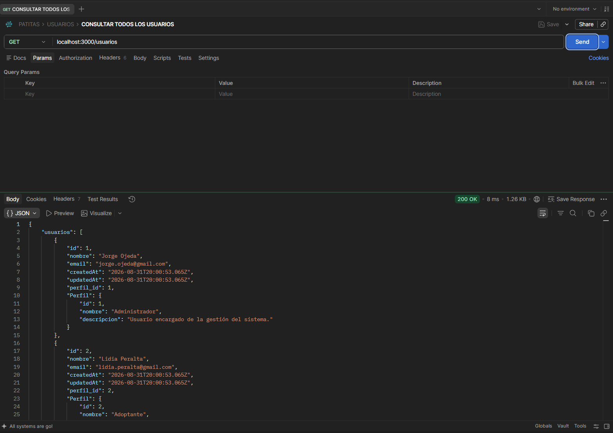

---

## 2. Consulta de perfiles

En esta prueba se consultan los perfiles almacenados utilizando el CRUD desarrollado con `pg`.

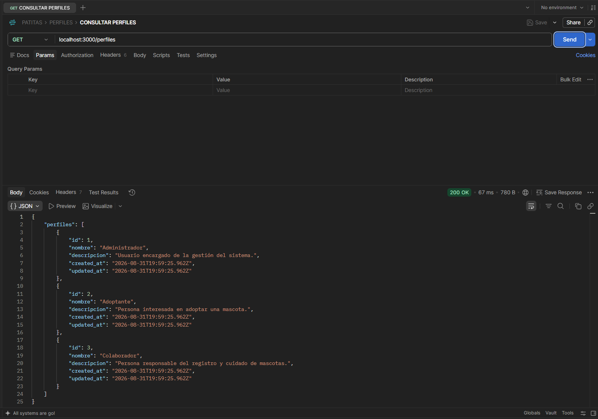

---

## 3. Consulta de mascotas

En esta consulta se muestran los datos de cada mascota junto con su usuario y su ficha relacionada.

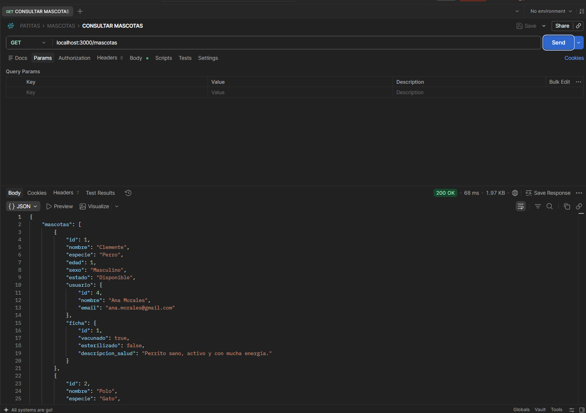

---

## 4. Consulta de solicitudes

La consulta devuelve cada solicitud con la información del usuario y de la mascota relacionada.

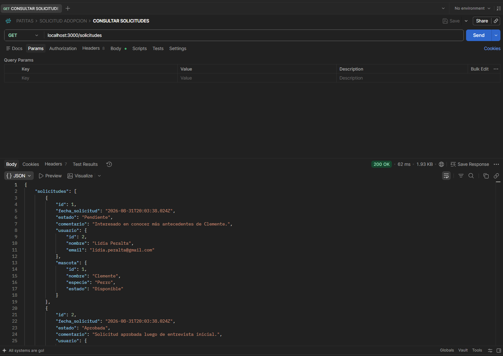

---

## 5. Creación de Mascota + FichaMascota

Esta operación crea una mascota y posteriormente su ficha utilizando una misma transacción.

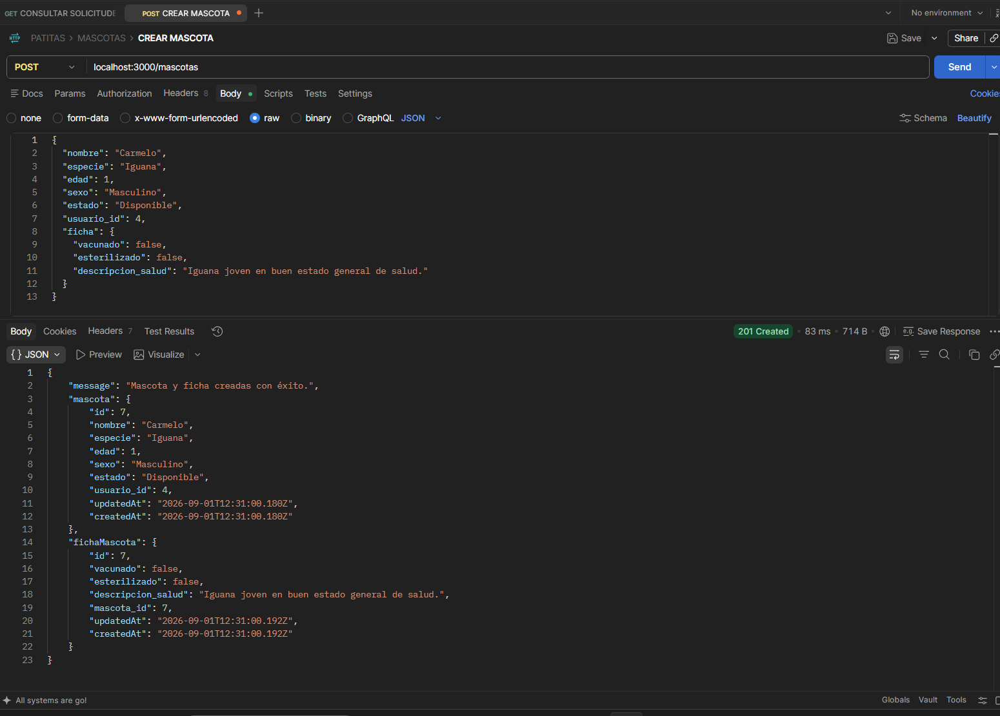

---

## 6. Actualización de solicitud

Se actualiza el estado y comentario de una solicitud existente.

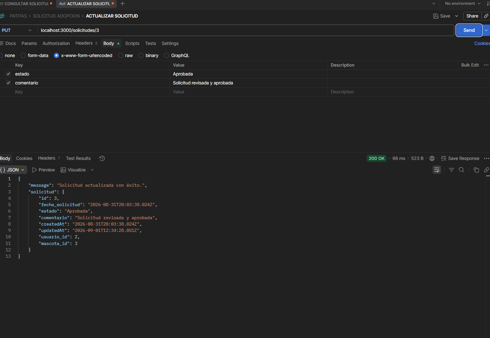

---

## 7. Eliminación de un registro

Prueba de operación DELETE mediante Postman.

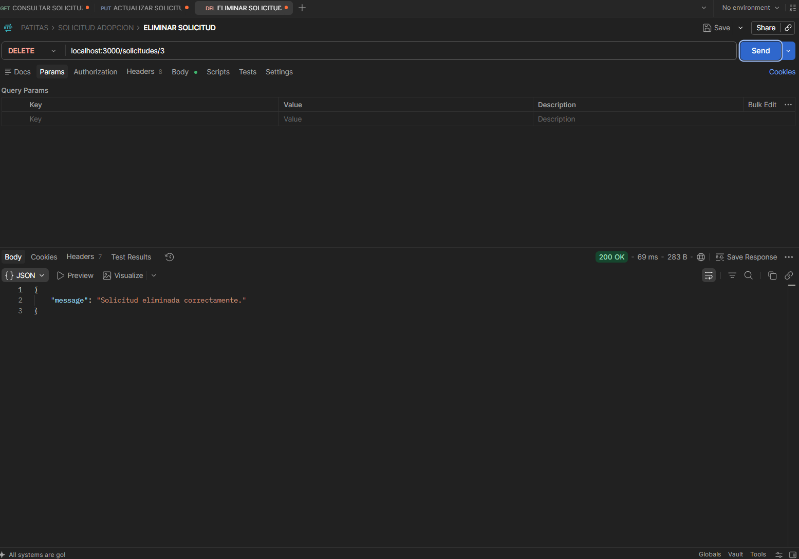

---

## 8. Error provocado para probar ROLLBACK

En esta prueba se envía intencionalmente información inválida durante la creación de la ficha.

La segunda operación falla y se ejecuta el rollback.

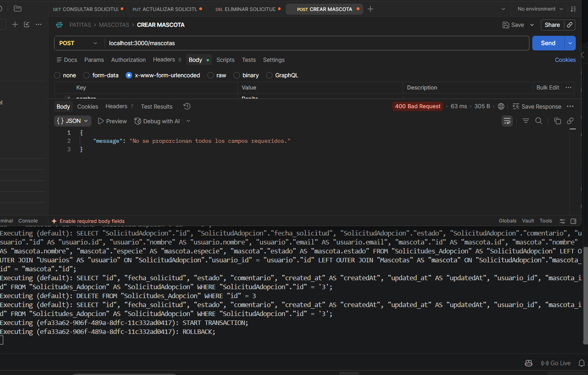

---

## 9. Comprobación del ROLLBACK en PostgreSQL

Después del error se realiza la consulta:

```sql
SELECT *
FROM "Mascotas"
WHERE nombre = 'PruebaRollback';
```

La consulta no devuelve registros, demostrando que la mascota tampoco quedó almacenada.

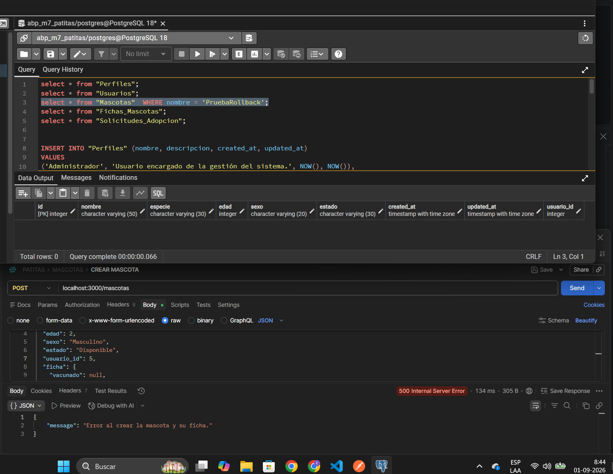

---

## 10. Base de datos PostgreSQL

Vista general de las tablas creadas para el proyecto.

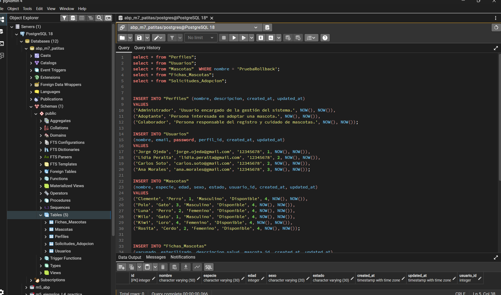

---

## 11. Relaciones entre las tablas

Vista de las relaciones y claves foráneas utilizadas en PostgreSQL.

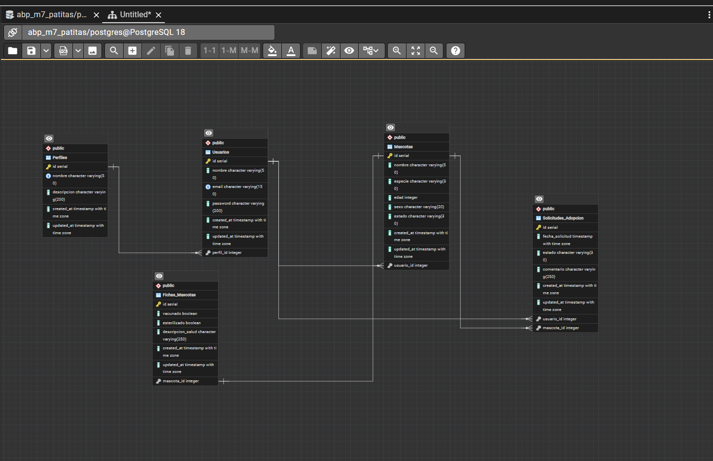

---

# 💡 Decisiones tomadas durante el desarrollo

## Utilizar pg y Sequelize

Decidí utilizar ambos métodos porque durante el módulo fueron contenidos importantes.

El CRUD de Perfil fue desarrollado principalmente mediante SQL directo utilizando `pg`.

Los modelos Usuario, Mascota, FichaMascota y SolicitudAdopcion fueron trabajados principalmente mediante Sequelize.

Esto me permitió comparar las dos formas de acceder a PostgreSQL.

---

## No desarrollar una interfaz adicional

Durante el proyecto evalué crear una página HTML que consumiera las rutas utilizando `fetch`.

Sin embargo, finalmente decidí no incorporarla porque no corresponde a uno de los requisitos necesarios para cerrar esta etapa.

Preferí concentrarme en los contenidos propios del Módulo 7:

- PostgreSQL.
- SQL.
- Sequelize.
- CRUD.
- Relaciones.
- Transacciones.

---

## No implementar autenticación todavía

No incorporé JWT ni autenticación en esta etapa porque estos contenidos corresponden a la siguiente fase del proyecto integrador.

La idea es dejar este backend preparado para continuar su desarrollo durante el Módulo 8.

---

# 📋 Resumen de funcionalidades desarrolladas

Durante esta etapa del proyecto implementé:

- PostgreSQL como base de datos.
- Conexión mediante `pg`.
- Conexión mediante Sequelize.
- Variables de entorno.
- CRUD de Usuarios.
- CRUD de Perfiles.
- CRUD de Mascotas.
- CRUD de Solicitudes.
- Fichas de mascotas.
- SQL parametrizado.
- Relación Perfil 1:N Usuario.
- Relación Usuario 1:N Mascota.
- Relación Mascota 1:1 FichaMascota.
- Relación Usuario N:M Mascota mediante SolicitudAdopcion.
- Claves foráneas.
- `include`.
- Alias.
- Filtrado mediante `attributes`.
- Transacciones con `pg`.
- Transacciones con Sequelize.
- `COMMIT`.
- `ROLLBACK`.
- Prueba real de rollback.
- Manejo de errores.
- Validaciones.
- Datos semilla.
- Pruebas mediante Postman.
- Verificación de persistencia mediante pgAdmin.

---

# 📚 Aprendizajes obtenidos

Durante este módulo pude comprender con mayor claridad cómo una aplicación Node.js puede guardar información en una base de datos real.

Trabajar directamente con `pg` me permitió comprender de una forma más clara las consultas SQL y el uso de parámetros.

Después, al trabajar con Sequelize, pude observar cómo un ORM permite representar las tablas mediante modelos y simplificar algunas operaciones.

Uno de los conceptos que más pude comprender con este proyecto fue el uso de transacciones.

Al crear una mascota y su ficha dentro de una misma transacción pude comprobar que `ROLLBACK` permite evitar que la base de datos quede con información incompleta.

También pude comprender mejor las relaciones entre tablas y el uso de claves foráneas.

---

# 🏁 Conclusión

Este proyecto permitió evolucionar la aplicación Patitas desde una persistencia más básica utilizada anteriormente hacia una base de datos PostgreSQL real.

Durante esta etapa pude trabajar tanto SQL directamente como Sequelize ORM.

Además pude implementar relaciones entre diferentes modelos y comprobar su funcionamiento utilizando `include`.

Las transacciones permitieron asegurar que operaciones relacionadas se ejecutaran completamente o fueran revertidas cuando existiera algún error.

Con esto el backend queda preparado para continuar avanzando durante el siguiente módulo, incorporando posteriormente nuevos elementos relacionados con APIs REST, autenticación y seguridad.